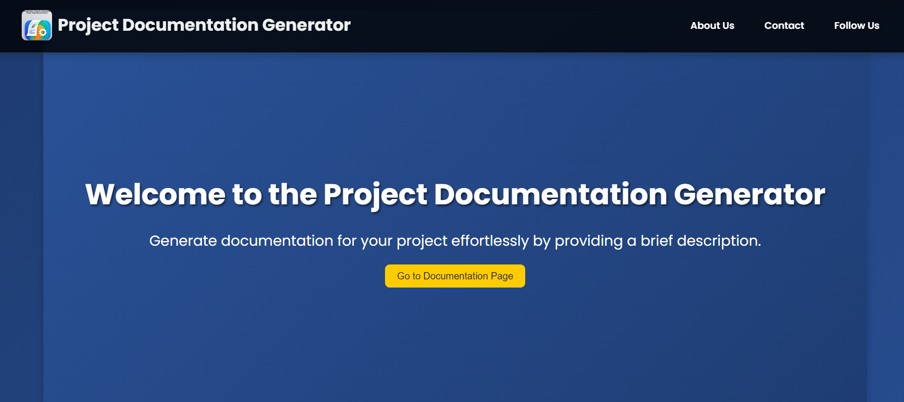

## **Project Document Creator**

# 

## **Project Document Creator**

Welcome to **Project Document Creator** – a powerful platform designed to help you effortlessly generate professional project documentation. Whether you're working on a personal project or collaborating with a team, this tool streamlines the creation of comprehensive, well-structured documents for your project.

📍 **Website Link**: [Project Document Creator](https://project-document-creator.onrender.com)

---

## 📋 **Features**

- 📝 **Project Documentation Generation**: Automatically generate professional documentation with sections like Abstract, Introduction, Literature Survey, Analysis & Design, and more.
- 📧 **Email Notifications**: Get notified about user registrations, logins, and document generation activities.
- 🔒 **OTP-based Registration**: Secure user registration process with OTP verification for enhanced security.
- 🚀 **Reliability**: With Jenkins integration, the website is continuously pinged every minute to prevent downtime.
- 🛠 **User Authentication**: Login and registration functionalities ensure a personalized experience.
- 📄 **Easy-to-Use Interface**: Simple and intuitive user interface for seamless interaction with the platform.

---

## 📸 **Screenshots of the Platform**

Take a look at the amazing features and user interface of **Project Document Creator**:

1. **Homepage View**  
   
   
2. **Login Page**  
   
   

3. **Registration Page**  
   
   

4. **Dashboard After Login**  
   
   
   

5. **Document Generation Page**  
   
   

These screenshots give a glimpse of the sleek, user-friendly interface and the smooth experience users will enjoy on the platform. 🚀

---

## 💻 **How to Use**

1. **Register**: Start by creating an account. Enter your details and verify your email using the OTP sent to your inbox.
2. **Login**: Once registered, log in with your credentials to access the platform.
3. **Generate Document**: Provide a project description and let the platform generate a structured project document for you.
4. **Notifications**: Stay informed with email alerts on your registration, login, and document generation activities.

---

## 🌐 **Why Use This Website?**

- **Effortless Documentation**: Save hours of manual work by automatically generating detailed project documents.
- **Reliability Guaranteed**: Thanks to the integration with Jenkins, the website is kept alive and pinged every minute, ensuring a reliable experience.
- **User-Friendly**: Designed with the user in mind, our platform offers a seamless experience with minimal effort.
- **Secure**: OTP-based registration ensures that only authorized users can access your platform.

---

## 🌟 **About the Creator**

👨‍💻 **Shaik Sameer Hussain**  
A passionate software engineer with a strong focus on web development, AI, and DevOps. Proficient in multiple programming languages and technologies, I aim to make powerful tools like **Project Document Creator** to simplify complex tasks.

- 💼 [LinkedIn Profile](https://www.linkedin.com/in/shaik-sameer-hussain-b88323250/)
- 📧 Contact: [shaiksameerhussain2104@gmail.com](mailto:shaiksameerhussain2104@gmail.com)

---

## ⚡ **Appreciation for the Work**

This project is a testament to **Shaik Sameer Hussain's** commitment to delivering high-quality, practical solutions that save time and enhance productivity. By combining AI-driven content generation with intuitive UI and seamless functionality, this platform helps professionals create detailed documentation in minutes. His expertise in web development, AI, and DevOps has resulted in an innovative and reliable tool for the tech community. 🙌

---

## 🔗 **Links & Resources**

- **Platform**: [Project Document Creator](https://project-document-creator.onrender.com)
- **GitHub Repository**: [GitHub - Project Document Creator](https://github.com/Sameerq7/Project-Document-Creator)
- **Documentation**: Comprehensive documentation for users and contributors coming soon!

---

## 📝 **Acknowledgments**

- Thanks to the amazing developers and contributors from the open-source community who have made this project possible.
- Special thanks to the libraries and APIs used, such as Google Gemini, Flask, Firebase, and Jenkins.

---

## 📬 **Stay Connected**

If you have any questions, feedback, or suggestions, feel free to reach out:

- 📧 **Email**: [shaiksameerhussain2104@gmail.com](mailto:shaiksameerhussain2104@gmail.com)
- 🌐 **LinkedIn**: [Shaik Sameer Hussain](https://www.linkedin.com/in/shaik-sameer-hussain-b88323250/)

---

**Thank you for visiting!** 🙏
